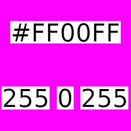
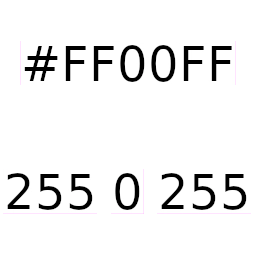

# NoMorePink


NoMorePink is a simple and efficient bash script designed to process image files in a directory and its subdirectories. It converts a specific color (magenta `#ff00ff`) to transparency using [ImageMagick](https://imagemagick.org/index.php), while preserving the directory structure in the output.

*BEFORE*



*AFTER*



## Why This Project Exists

Many old pixel art tilesets and sprites use magenta (`#ff00ff`) as a background color to denote transparency. However, using images with a magenta background can be problematic when integrating them into modern projects that expect true transparency. NoMorePink automates the process of converting this magenta background to transparency, making it easier to use these assets universally without the need for additional software.

## Features

- Recursively processes all image files in the input directory and its subdirectories.
- Converts the color `#ff00ff` (magenta) to transparency in each image.
- Maintains the original directory structure in the output directory.

> Images that don't support transparency, like JPEG images, are not compatible.
> Indeed, in order to keep things simple this script is not taking care of the conversation of JPEG images to PNG images. If you have JPEG images you will have to convert them before.

## Requirements

Ensure that ImageMagick is installed on your system. You can install it using the following command:

```sh
  sudo apt-get install imagemagick
```

Run `chmod +x script.sh` to make the file executable.

## Usage

1. Place your input images in the `input` directory.
2. Run the script using the command: `./script.sh`
3. The new images will be saved in the `output` directory, maintaining the same directory structure as the input directory.

## Contributing

Contributions are welcome! Here are a few ways you can contribute:

- Report bugs or issues
- Suggest new features or enhancements
- Submit pull requests

## License

This project is licensed under the [MIT License](LICENSE).
